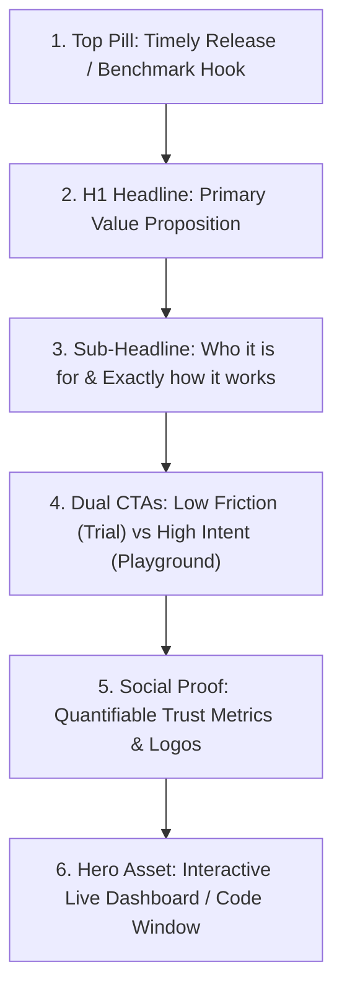

# The SaaS Launch & Conversion Architecture Playbook
### A Tactical Field Guide for Launching High-Performing Developer & AI Tools

> **Included as a Premium Resource with the Nexus AI Framer Template**  
> *Author: Nexus Digital Assets • Version 2.0 (2026 Edition)*

---

## Introduction: Why Most DevTools Launch to Silence

Every week, hundreds of talented software engineers launch ambitious AI tools, SaaS apps, and APIs. They spend months architecting database schemas, optimizing latency, and fine-tuning prompt pipelines. 

Yet on launch day, 90% encounter total silence.

They blame their algorithm, their product features, or their lack of venture funding. But the real culprit is almost always **Conversion Architecture**. 

Developers buy with their eyes and their logic:
1. They decide whether your product is credible within **3.2 seconds**.
2. If your website looks amateur or clunky, they assume your code is amateur and buggy.
3. If you force them to read walls of generic text instead of seeing syntax and proof, they bounce immediately.

This playbook gives you the exact blueprint to transform your **Nexus AI** template into a high-converting customer acquisition engine.

---

## Chapter 1: The SaaS Conversion Equation

Every high-performing B2B landing page operates on a simple psychological equation:

$$\text{Conversion Rate} = \frac{\text{Perceived Value} \times \text{Speed to Value}}{\text{Perceived Risk} \times \text{Friction}}$$

### The 4 Levers:
1. **Perceived Value:** Don't sell the technology; sell the commercial outcome. Instead of *"We offer vector-indexed Redis proxy caching"*, write *"Cut your monthly LLM bills by 64% on day one"*.
2. **Speed to Value:** Show them how fast they can get results. The one-line code snippet (changing only `baseURL`) is the ultimate speed-to-value hook.
3. **Perceived Risk:** Mitigate risk before they even ask. Include SOC2 compliance badges, zero data retention promises, and a generous free tier that doesn't require a credit card.
4. **Friction:** Keep the signup form to one field: Work Email or "Continue with GitHub". Every extra form field slashes conversions by 12%.

---

## Chapter 2: High-Converting Above-The-Fold Architecture

The viewport above the fold is responsible for **70% of your visitor bounce rate**. 

### The 5 Essential Above-The-Fold Elements:
1. **The Announcement Pill:** Informs visitors that the product is actively maintained and shipping updates (e.g., `NEW: v2.4 Semantic Caching is Live`).
2. **The "Verb-Outcome" Headline:** Avoid vague poetic slogans like *"The Future of Intelligence"*. Use clear, outcome-driven language: *"Route, Cache, and Monitor LLM Calls at Sub-Millisecond Speed"*.
3. **The Concrete Sub-Headline:** 2–3 sentences that state exactly who the tool is for and what problem it solves.
4. **The Dual-Action Button Pairing:**
   - *Primary:* High-contrast electric cyan button for the immediate conversion path (`Deploy in 60 Seconds`).
   - *Secondary:* Subtle glass button for visitors who need proof before signing up (`Explore Interactive Demo`).
5. **The Interactive Proof Window:** Never use a generic stock photo. Use the included interactive mock dashboard or the `<CodeSnippetTabs />` component. Developers need to see real code to believe it works.

---

## Chapter 3: Setting Up Custom Domains & DNS in Framer

Framer includes global CDN hosting powered by AWS CloudFront and Cloudflare. To connect your custom domain:

### Step-by-Step DNS Setup:
1. In your Framer Project, navigate to **Site Settings** ➔ **Domains**.
2. Click **Add Custom Domain** and enter your root domain (e.g., `yourapp.com`).
3. Framer will provide your unique DNS records:
   - **Type A Record:** Points `@` to Framer's Anycast IP (`52.223.52.2` and `35.71.142.77`).
   - **CNAME Record:** Points `www` to `sites.framer.app`.
4. Log into your domain registrar (Cloudflare, Namecheap, or Porkbun):
   - Add both A records and the CNAME record.
   - If using Cloudflare DNS, set the proxy status to **DNS Only (Grey Cloud)** during initial verification.
5. Framer automatically issues and renews an SSL certificate via Let's Encrypt within 5–15 minutes.

---

## Chapter 4: Technical SEO & OpenGraph Optimization

To ensure your SaaS ranks organically on Google and displays beautifully when shared on X/Twitter, LinkedIn, and Discord:

### 1. Page Title & Meta Tags Formula
* **Home Page Title:** `[Product Name] — [Primary Capability] & [Key Benefit]`  
  *Example:* `Nexus AI — Intelligent LLM Gateway & Observability Engine`
* **Meta Description:** Keep under 155 characters. State the core value proposition and include a direct call to action.  
  *Example:* `Cut your AI token costs by 64% and eliminate downtime with automated multi-model failover. Deploy your gateway in 60 seconds.`

### 2. OpenGraph (Social Share Image) Standards
* Dimensions: `1200px × 630px` (aspect ratio 1.91:1).
* Format: PNG or WebP under 300KB.
* Design: Dark background with your logo, headline in high-contrast white, and a preview of the interactive dashboard mockup.
* In Framer: Set this globally under **Site Settings ➔ General ➔ Social Share Image**.

### 3. Clean URL Routing & Slugs
* Use lowercase, hyphen-separated slugs: `/blog/semantic-caching-benchmarks` instead of `/blog/Post_1`.
* Ensure every page has a self-referencing Canonical URL configured in Framer's page settings.

---

## Chapter 5: Integrating Checkout & Subscriptions

Your landing page must make subscribing completely effortless.

### Option A: Stripe Checkout (Direct & Standard)
1. Set up your products in the Stripe Dashboard (e.g., *Pro Monthly: $49/mo*, *Pro Annual: $468/yr*).
2. Generate a **Stripe Payment Link** or integrate **Stripe Customer Portal**.
3. In Framer, select your pricing card CTA buttons and paste your Stripe Payment Link directly into the `Link` field.
4. Set the link target to `Open in New Tab` or use Stripe's embedded iframe checkout overlay.

### Option B: Lemon Squeezy (Merchant of Record - Recommended for Solopreneurs)
* **Why Lemon Squeezy:** They act as your Merchant of Record, meaning they automatically collect and remit global sales tax, EU VAT, and country-specific digital levies so you never have to file foreign tax reports.
* **Setup:** Create a product on Lemon Squeezy, grab the Checkout URL, and toggle the **Lemon.js Overlay** embed code into Framer's **Site Settings ➔ Custom Code ➔ End of `<head>`**.

---

## Chapter 6: The 7-Day Pre-Launch & Distribution Checklist

Do not wait for Google to find your website. Follow this tactical 7-day launch cadence:

| Timeline | Platform / Action | Core Objective |
| :--- | :--- | :--- |
| **Day 1: Seed** | **GitHub & Open Source** | Publish your client SDK or an open-source "Lite" proxy repo. Add the Nexus website link in the repo's README. |
| **Day 2: Reddit** | **r/SideProject & r/webdev** | Post an authentic technical teardown: *"I spent 3 months benchmarking LLM latency overhead—here are the real numbers (+ live demo)"*. |
| **Day 3: Directories** | **Startup Directories** | Submit your site to: *TheresAnAIForThat*, *Toolify*, *Futurepedia*, *AlternativeTo*, and *BetaList*. |
| **Day 4: Hacker News** | **Show HN** | Post with strict format: `Show HN: Nexus – Open-source intelligent LLM caching gateway`. Keep description purely technical. |
| **Day 5: Product Hunt** | **Official Launch** | Schedule your launch for 12:01 AM PST on a Tuesday or Wednesday. Engage with every single commenter. |
| **Day 6: Communities** | **Discord & Slack Groups** | Share in developer discords (Supabase, Vercel, LangChain, local AI meetups) offering free trial credits for feedback. |
| **Day 7: Retargeting** | **Email Onboarding** | Send your first automated onboarding email sequence to all signups from the week. |

---

## Chapter 7: Analytics & Privacy-Friendly Telemetry

Never launch blind. You must know where your visitors drop off in the conversion funnel.

### Recommended Tool Stack:
* **Plausible Analytics / PostHog:** Lightweight, GDPR-compliant, cookie-less analytics.
* **Framer Integration:** Paste the tracking script into **Site Settings ➔ Custom Code ➔ Head**.
* **Key Metrics to Track:**
  1. **Hero CTA Click-Through Rate:** Target: **> 8%**.
  2. **Code Tab Switch Engagement:** Target: **> 15%** (indicates strong developer interest).
  3. **Pricing Table Visit-to-Checkout Rate:** Target: **> 3.5%**.

---

*(End of Companion Playbook — Nexus Digital Assets)*
