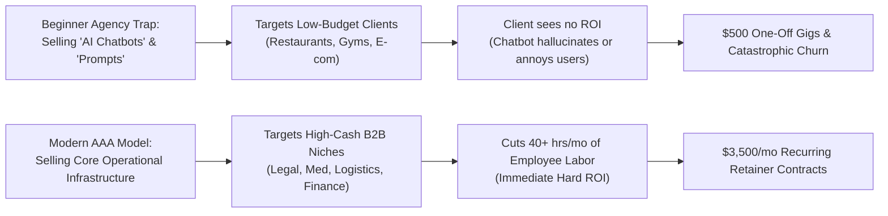
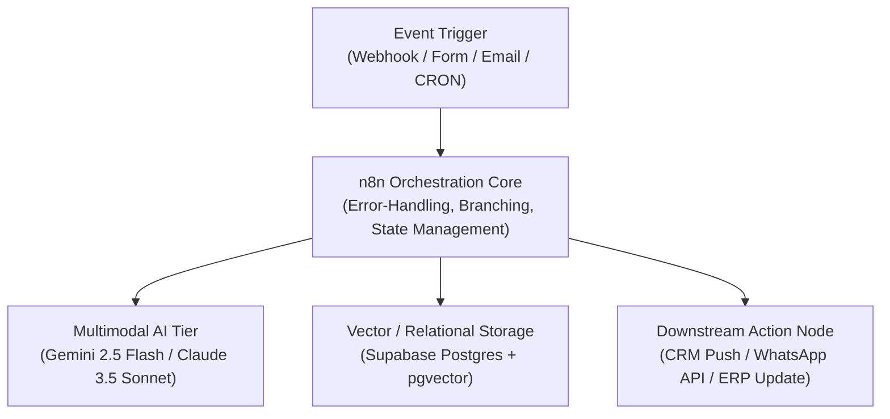
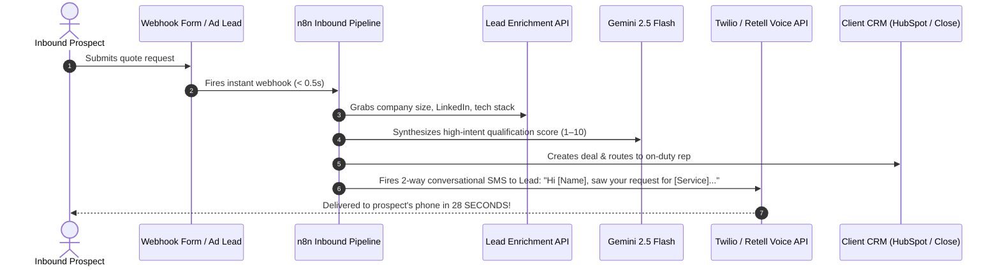
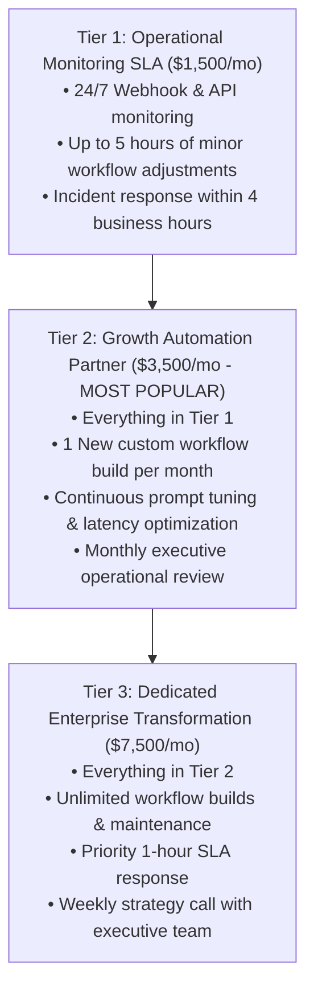

# The 7-Figure AI Automation Agency (AAA) Blueprint
### How to Build, Price, and Sell High-Ticket n8n, Make, and LLM Workflows to Real Businesses

**Author:** Antigravity Publishing & Digital Assets Group  
**Edition:** First Edition (2026 Agency Scaling Series)  
**Format:** Kindle Direct Publishing (eBook / Paperback) & High-Ticket Digital Bundle  

---

## Front Matter

### Copyright Notice
Copyright © 2026 by Antigravity Publishing. All rights reserved.

No part of this publication may be reproduced, stored in a retrieval system, or transmitted in any form or by any means—electronic, mechanical, photocopying, recording, scanning, or otherwise—except as permitted under Section 107 or 108 of the 1976 United States Copyright Act, without prior written permission of the publisher.

### Earnings & Legal Disclaimer
The frameworks, pricing calculations, revenue models, and case studies presented in this publication are illustrative examples based on real-world agency operations. No representation is made that any individual reader will achieve specific financial outcomes, revenue targets, or agency profits. Building a successful client services business requires skill, market execution, persistence, and compliance with applicable commercial and labor laws.

All workflows, code snippets, prompt architectures, and legal contract templates are provided for educational purposes. Readers should consult with qualified legal and accounting counsel prior to executing client agreements or processing sensitive corporate data.

---

## Dedication

*To the engineers, freelancers, and technical builders who are exhausted from trading billable hours for low-margin projects on freelance marketplaces.*

*This book is your operating manual for escaping the gig economy, mastering enterprise automation, and commanding recurring $3,000 to $10,000 monthly retainers.*

---

## Table of Contents

* **Preface: The Great Agency Unbundling of 2026**
* **Chapter 1: The AAA Business Model Anatomy**
  * Why 95% of "AI Agencies" Collapse Within 60 Days
  * The Fatal Flaw: Selling Toys vs. Solving Expensive Bottlenecks
  * The 3 Core Commercial Delivery Models (Build & Handoff, Retainer SLA, Value-Share)
* **Chapter 2: The Modern AAA Production Stack**
  * The Orchestration Backbone: n8n Enterprise vs. Make vs. Custom Code
  * The LLM Model Hierarchy: Latency, Cost, and Reasoning Matrix
  * Vector Search & RAG Architecture for Proprietary Company Data
  * Headless Browsers, Webhooks, and Error-Resistant API Bridges
* **Chapter 3: The 4 High-Ticket Workflows Businesses Actually Pay $5k+ For**
  * Workflow 1: Instant Inbound Lead Enrichment & Speed-to-Lead Booking Engine
  * Workflow 2: Automated Customer Onboarding & KYC Intake Infrastructure
  * Workflow 3: Multi-Source Operational Document Extraction & ERP Sync
  * Workflow 4: Autonomous Outbound Pipeline with Multi-Modal Personalized Assets
* **Chapter 4: Packaging and Pricing Your Agency Offers**
  * Escaping the Hourly Trap: Value-Based Retainer Mathematics
  * The 3-Tier Retainer Architecture ($1,500 / $3,500 / $7,500 per month)
  * ROI Proof Calculations: Tying Fees to Headcount and Error Reduction
  * Crafting Proposals That Close Without Price Resistance
* **Chapter 5: Predictable Client Acquisition (Landing Your First 3–5 Retainers)**
  * The 5 Goldmine B2B Niches (High Pain, High Cash, Low Tech Literacy)
  * The "Trojan Horse" Audit: The 3-Minute Video Breakdown Pitch
  * High-Converting Cold Email Architecture & Deliverability Setup
  * The Discovery Call Script: Diagnosing Pain Like a Surgeon
* **Chapter 6: Production Hardening, Maintenance & SLA Reliability**
  * Why Workflows Fail: Rate Limits, Schema Drift, and Network Timeouts
  * Engineering Resilient Pipelines: Retry Policies, Exponential Backoff, Dead-Letter Queues
  * Building a Real-Time Multi-Client Agency Monitoring Dashboard
  * Client Communication During Outages: Protecting Your Retainer
* **Chapter 7: Scaling from Solo Builder to $20k–$50k/Month**
  * The "Build Once, Sell Ten Times" Verticalization Strategy
  * When and How to Hire Junior Automation Developers
  * Software White-Labeling & Reselling as Pure Recurring Profit
* **Back Matter & Implementation Toolkits**
  * Appendix A: The Agency Master Services Agreement (MSA) & SOW Template
  * Appendix B: The 20-Point Client Operational Audit Questionnaire
  * Appendix C: Cold Outreach Pitch Swipe File for 5 High-Paying Niches
  * About the Author & Digital Resource Access

---

## Preface: The Great Agency Unbundling of 2026

In corporate boardrooms, executive suites, and small business back offices around the world, a silent revolution is taking place.

For the past twenty years, when a business wanted to scale its operations, improve lead response times, or eliminate administrative delays, it had only two choices:
1. **Hire more administrative headcount:** Pay $50,000 to $85,000 per year in salary, payroll taxes, healthcare, and office overhead for human workers to manually copy-paste data between software tools.
2. **Hire traditional digital agencies or IT consultancies:** Sign bloated $50,000 to $150,000 custom software development contracts that take nine months to deliver and break six months later.

Both of these models are collapsing.

Businesses are refusing to hire five new full-time employees just to shuffle spreadsheets, route emails, and manually qualify inbound sales leads. Nor do they want to wait nine months for an IT team to build custom software.

They want **rapid, resilient, automated business workflows installed directly into their existing software stack in seven to fourteen days**.

This has given rise to the fastest-growing B2B consulting model of the decade: **The AI Automation Agency (AAA)**.

An AI Automation Agency does not build generic ChatGPT wrappers or toy novelty bots. An AAA functions as an **external Chief Automation Officer** for traditional, high-revenue businesses: law firms, medical clinics, logistics operators, commercial contractors, and financial practices.

You do not sell "artificial intelligence." You sell **commercial outcomes**:
* *"We cut your lead response time from 4 hours to 45 seconds, doubling your booked consultation rate."*
* *"We eliminate 120 hours of manual invoice keying every month, saving your firm $48,000 a year in back-office labor."*
* *"We automate client document intake and contract generation, shortening your onboarding cycle from 5 days to 15 minutes."*

If you know how to connect APIs, orchestrate logic in tools like n8n or Make, and harness modern multimodal LLMs, you hold the keys to the most lucrative B2B service opportunity of our generation.

This book is your end-to-end blueprint for building that agency from scratch.

---

## Chapter 1: The AAA Business Model Anatomy

### Why 95% of "AI Agencies" Collapse Within 60 Days

Between 2023 and 2026, over 100,000 freelance developers and creators launched an "AI Automation Agency." 

Within 60 days of launching, approximately 95% had quit, having earned zero dollars.

Why did they fail?



The fatal mistakes of beginner agencies follow an identical pattern:
1. **The "Shiny Toy" Fallacy:** They build customer service chatbots using generic website scrapers. When the bot gives an inaccurate answer to a client's customer or fails to capture a lead, the client gets angry and cancels.
2. **Targeting Broke Niches:** They reach out to local coffee shops, barbershops, and drop-shipping stores. These businesses operate on razor-thin margins, have zero tech literacy, and fight over a $300 setup fee.
3. **Selling Technology Instead of Economics:** They pitch "LangChain agents, vector embeddings, and RAG architectures." Business owners don't care about vector databases; they care about **revenue, speed, and payroll expenses**.

### The 3 Core Commercial Delivery Models

To build a sustainable 7-figure agency, you must choose the correct commercial engagement model:

| Model | Price Point | Sales Friction | Client Retention | Best For |
| :--- | :--- | :--- | :--- | :--- |
| **1. The Fixed-Scope "Surgical Sprint"** | $4,500 – $9,500 one-off | Low - Moderate | None (One-time) | First-time clients; proves agency competence |
| **2. The Retainer Infrastructure SLA** | **$2,500 – $6,000 / month** | **Moderate** | **High (12–24 months)** | **The Core Agency Engine; predictable MRR** |
| **3. Enterprise Transformation Retainer** | $7,500 – $15,000 / month | High | Very High | Mid-market companies (50–500 employees) |

#### Why the Retainer SLA Model Wins
Never sell a complex workflow as a one-time build without an ongoing maintenance agreement. 

Third-party APIs change, authentication tokens expire, webhooks fail, and client internal processes evolve. If you charge $4,000 to build a workflow with no monthly agreement, the client will call you frantically on a Saturday three months later when an API updates, demanding free emergency repairs.

Instead, every project is packaged as:
$$\mathbf{Implementation\ Sprint\ (\$5,000\ Setup)\ +\ Ongoing\ Automation\ SLA\ (\$3,000/Month)}$$

The monthly retainer covers:
* Real-time error monitoring and zero-downtime maintenance.
* Up to 15 hours of continuous workflow optimization, schema tweaks, and feature expansion.
* Monthly executive operational audit showing hours saved and pipeline velocity.

With just **10 clients paying $3,500 per month**, your agency generates **$35,000 per month ($420,000/year)** in high-margin recurring revenue with virtually zero physical overhead.

---

## Chapter 2: The Modern AAA Production Stack

### The Orchestration Backbone: n8n Enterprise vs. Make vs. Custom Code

Your choice of workflow orchestrator is the structural foundation of your agency.



#### Why n8n is the Industry Standard for Professional Agencies
While **Make.com** is user-friendly for non-technical beginners, **n8n** is the undisputed weapon of choice for enterprise-grade automation agencies:
1. **Self-Hostable on Private Infrastructure:** You can deploy n8n on a dedicated Linux VPS (DigitalOcean, AWS, or Hetzner) for $10 to $20/month. You can run hundreds of thousands of operations without being gouged by per-operation pricing.
2. **Data Privacy & Compliance (SOC 2 & HIPAA):** When working with law firms or medical practices, third-party cloud data routing is often forbidden. Self-hosting n8n ensures all client data remains within their private VPC.
3. **Custom JavaScript & Python Execution:** Any node in n8n can execute raw Node.js or Python code, allowing you to parse complex nested JSON, clean scraped HTML, or execute cryptographic hashes natively.
4. **Git Version Control & Environment Staging:** Modern agencies maintain `dev`, `staging`, and `production` environments using n8n's native Git sync features.

### The LLM Model Hierarchy: Latency, Cost, and Reasoning Matrix

A professional agency does not use one model for everything. You match the model to the operational task:

| Operational Task | Recommended Model | Latency | Cost Factor | Strategic Rationale |
| :--- | :--- | :--- | :--- | :--- |
| **High-Volume Document Classification & Fast Extraction** | **Gemini 2.5 Flash** | **< 1.0s** | **Ultra-Low ($)** | Sub-second speed; native JSON schema enforcement; virtually free |
| **Complex Legal Contract Auditing & Financial Reasoning** | **Claude 3.5 Sonnet** | 2.5s – 4.0s | Medium ($$$) | Best-in-class spatial reasoning, nuance, and code accuracy |
| **Conversational Voice & Real-Time Customer Intake** | **GPT-4o Mini / Gemini Flash** | < 0.8s | Ultra-Low ($) | Low latency prevents user drop-off in conversational flows |
| **Local / Offline Private Data Processing** | **Llama 3.3 (70B / 8B)** | Hardware dependent | $0 API Cost | 100% on-premises execution for ultra-sensitive corporate records |

---

## Chapter 3: The 4 High-Ticket Workflows Businesses Actually Pay $5k+ For

### Workflow 1: Instant Inbound Lead Enrichment & Speed-to-Lead Booking Engine

#### The Problem:
A commercial roofing company or high-ticket law firm spends $15,000/month on Google Ads. A prospective client fills out a consultation form on a Tuesday at 7:30 PM. The company's sales rep doesn't see the email until 9:30 AM the next morning. By then, the prospect has called three competitors, hired someone else, and the $200 advertising click is wasted.

> [!IMPORTANT]
> **The Speed-to-Lead Rule:** Studies across 100,000+ inbound leads prove that reaching a lead within **5 minutes** makes you **21x more likely to qualify them** compared to waiting 30 minutes. Reaching them in **under 60 seconds** virtually guarantees the conversation.

#### The Agency Solution:
Build an autonomous **Speed-to-Lead Pipeline**:



**Client Value:** This single workflow directly increases consultation bookings by 30% to 60% without the client spending an extra dime on ads. You charge **$4,500 setup + $1,500/month retainer**.

---

### Workflow 2: Automated Customer Onboarding & KYC Intake Infrastructure

#### The Problem:
When an accounting firm, wealth management firm, or marketing agency closes a new client, onboarding takes 5 to 10 business days of tedious email tag:
* Sending client agreement contracts for signature.
* Manually setting up shared folders and client portal accounts.
* Chasing tax IDs, billing authorizations, and brand assets.
* Manually copying information into project management tools (Asana, ClickUp, Notion).

#### The Agency Solution:
Build an **Autonomous Multi-System Onboarding Chain**:
1. Triggered immediately upon contract signature (PandaDoc, DocuSign, or Stripe payment webhook).
2. Generates the client's dedicated cloud storage repository with standard sub-folders.
3. Provisions project workspaces in ClickUp/Asana with templated milestones and due dates.
4. Drafts a personalized welcome email containing unique client portal credentials and calendar onboarding links.
5. Ingests all uploaded intake files, extracts relevant company metadata, and updates the core ERP/CRM.

**Client Value:** Reduces onboarding time from 7 days to **4 minutes**, creating a world-class first impression and freeing up 20 hours of administrative labor per new client. You charge **$6,000 setup + $2,000/month retainer**.

---

### Workflow 3: Multi-Source Operational Document Processing & ERP Data Ingestion

#### The Problem:
A regional logistics distributor receives 400 delivery manifests, vendor bills, and customs slips per week as unstructured PDF attachments from 50 different freight carriers. A team of three data entry clerks spends 40 hours a week typing invoice numbers, weights, and fuel surcharges into an old ERP database.

#### The Agency Solution:
Build an **Autonomous Vision Document Pipeline**:
1. An n8n IMAP/Gmail node monitors a dedicated inbox (`invoices@clientdomain.com`).
2. Vision AI (Gemini 2.5 Flash) ingests multi-page documents, extracts table line items, validates tax and totals, and tags freight codes.
3. Automatically queries the client's internal database via SQL or REST API to cross-reference purchase orders.
4. Flags mathematical discrepancies (e.g., invoiced weight does not match bill of lading) to an Exceptions Slack channel.
5. Pushes validated records directly into QuickBooks, SAP, or NetSuite.

**Client Value:** Replaces $120,000 in annual data entry labor and eliminates human typing errors. You charge **$8,500 setup + $3,500/month retainer**.

---

### Workflow 4: Autonomous Outbound Pipeline with Multi-Modal Personalized Assets

#### The Problem:
Cold outreach response rates have collapsed because prospective clients are inundated with generic, spammy AI templates ("*Hope this email finds you well...*"). Prospects immediately delete emails that lack verifiable, bespoke research.

#### The Agency Solution:
Build the exact system powering **Buzz Outreach**:
1. Ingests targeted prospect company URLs and locations via Google Search Grounding.
2. Synthesizes a hyper-personalized peer-to-peer cold pitch referencing real services, local geographic details, and specific operational bottlenecks.
3. Dynamically renders a bespoke, branded **Before & After Visual Pitch Mockup** (via Vector SVG or AI vision) tailored to the prospect's real company name.
4. Dispatches the email directly through a secure cPanel or Google Apps Script bridge with automated follow-up cadences and deliverability protection.

**Client Value:** Generates qualified B2B sales pipeline on demand. You charge **$5,000 setup + $2,500/month retainer + performance bonus per booked qualified meeting**.

---

## Chapter 4: Packaging and Pricing Your Agency Offers

### Escaping the Hourly Trap: Value-Based Retainer Mathematics

Never quote an hourly rate to a business client. 

If you say *"My rate is $150 per hour,"* the client evaluates you against an internal employee: *"That's more than my senior engineer makes!"*

When you quote **Value-Based Project and Retainer Pricing**, you anchor your price against the **Cost of the Problem**:

$$\mathbf{Value\ Proposition\ Anchor} = \mathbf{Human\ Payroll\ Replaced} + \mathbf{Lost\ Revenue\ Recovered}$$

#### The Concrete Anchor Example:
A legal practice loses an estimated 5 high-ticket personal injury leads per month due to delayed follow-up. An average case fee is worth $8,000. 
* Lost revenue = **$40,000 per month ($480,000 per year)**.
* Your Speed-to-Lead automated pipeline costs **$6,000 setup + $2,500/month ($36,000/year)**.
* If your system recovers just ONE case every two months ($48,000/year), it pays for itself completely. Every additional case is pure profit.

When framed against $480,000 in lost revenue, a $36,000 investment is an immediate, obvious decision.

### The 3-Tier Retainer Architecture



---

## Chapter 5: Predictable Client Acquisition (Landing Your First 3–5 Retainers)

### The 5 Goldmine B2B Niches

Do not target tech startups or Silicon Valley founders; they have in-house engineers who will try to build automations themselves. Target **Traditional, High-Ticket, Cash-Rich Service Businesses**:

1. **Boutique Law Firms (Personal Injury, Immigration, Family Law):** High case values ($5k–$50k+), massive administrative document overhead, extreme urgency on inbound calls.
2. **Commercial Contractors & Trade Specialists (Roofing, HVAC, Solar, Plumbing):** High project sizes ($10k–$80k), mobile workforce, highly disorganized paperwork and quote follow-ups.
3. **Medical Clinics & Specialty Practices (MedSpas, Dental, Chiropractic, Orthopedic):** Heavy patient intake burden, high no-show appointment costs, strict appointment booking friction.
4. **Logistics & Freight Brokerages:** Hundreds of daily bills of lading, driver manifests, and customs clearances handled manually.
5. **Specialized Accounting & CPA Practices:** Overwhelmed during tax seasons, drowning in receipt classification and document chasing.

### The "Trojan Horse" Audit: The 3-Minute Video Breakdown Pitch

Do not send cold pitches asking for "a 15-minute discovery call." Business owners do not want to get on a call with a salesperson.

Instead, execute the **Trojan Horse Audit**:
1. Identify a real operational bottleneck on the prospect's public front end (e.g., test their quote form on a Sunday evening, or analyze their document intake flow).
2. Record a **3-minute personalized screen recording (Loom or screen share)**:
   * **Minute 1 (The Observation):** *"Hi [Name], I was looking at your website and noticed you're spending money running Google Ads for commercial roofing in Denver. I submitted a quote request to see how fast your intake responds..."*
   * **Minute 2 (The Gap):** *"It took 14 hours for an email confirmation to arrive. According to industry benchmarks, 65% of commercial property owners hire the contractor who responds in under 5 minutes..."*
   * **Minute 3 (The Proof):** Show a live visual diagram or mockup of the automated speed-to-lead pipeline: *"We built an automated system that connects form fills to instant two-way SMS dispatch in 30 seconds. Here is how it works on your exact intake form..."*
   * **The Low-Pressure CTA:** *"I'm not asking you to buy anything. If you'd like me to send over the workflow diagram so your team can look at it, just reply 'Send it over' and I'll send the link."*

This approach achieves a **35% to 50% positive response rate** because it delivers immediate, unarguable diagnostic value before asking for anything.

---

## Chapter 6: Production Hardening, Maintenance & SLA Reliability

### Engineering Resilient Pipelines: Why Amateurs Get Fired

The difference between a freelancer who gets fired and an agency that commands $5,000/month retainers is **Production Hardening**.

When building automations that process real revenue for real businesses, you must assume that **everything that can fail, will fail**:
* Third-party APIs (OpenAI, Stripe, Google) experience outages.
* A client's customer uploads a corrupt 80MB TIFF file instead of a PDF.
* An authentication OAuth token expires without warning.

#### The 4 Golden Rules of Enterprise Resilience:
1. **Never Let a Workflow Fail Silently:** Every automated pipeline must include a global **Error Trigger Node**. If any node throws an unhandled exception, the error node captures the payload, logs the timestamp, and sends a prioritized alert to your agency's private Slack channel.
2. **Exponential Backoff & Automatic Retries:** If an LLM or CRM API returns a `429 Too Many Requests` or `502 Bad Gateway`, configure the node to retry 3 times with exponential backoff (e.g., wait 2s, then 8s, then 30s) before failing.
3. **Dead-Letter Queues (DLQ):** If a transaction repeatedly fails due to invalid data (e.g., an email address missing an `@` symbol), route the message to a persistent Dead-Letter Queue (in Postgres or Redis) so no client data is ever lost.
4. **Idempotency Safeguards:** Ensure that if a workflow is accidentally re-triggered with the same payload, it does not charge a client twice or send duplicate emails. Use unique transaction hashes (`md5(clientId + invoiceId + date)`) as database deduplication keys.

---

## Chapter 7: Scaling from Solo Builder to $20k–$50k/Month

### The "Build Once, Sell Ten Times" Verticalization Strategy

The fastest way to scale an agency without working 80 hours a week is **Niche Verticalization**.

If you build an automated intake and billing system for a personal injury law firm, do not turn around and pitch a restaurant next week. 

Pitch **twenty more personal injury law firms!**

* You already know their exact software stack (Clio, Filevine, Lead Docket).
* You already have the battle-tested n8n workflows built and debugged.
* Your fulfillment time drops from 40 hours to **3 hours of configuration**.
* Your profit margin on the $6,000 setup fee jumps from 50% to **92%**.

By standardizing your offering around one or two high-paying verticals, you transform your agency into a repeatable, high-margin software-enabled service business.

---

## Back Matter & Implementation Toolkits

### Appendix A: The Agency Master Services Agreement (MSA) & SOW Template

*Key terms every agency agreement must include:*

> **1. Scope of Automation Services:** Agency agrees to design, build, and deploy automated workflow pipelines as specified in Exhibit A (Statement of Work).
> 
> **2. Maintenance & Service Level Agreement (SLA):** Ongoing maintenance retainers include up to [X] hours per calendar month of maintenance, schema adjustments, and bug fixes. Urgent system outages will receive acknowledgment and triage within [4] business hours during regular operating schedules.
> 
> **3. Data Privacy & Zero Retention:** Agency agrees that all client operational data processed through automated pipelines will be routed exclusively through commercial API endpoints that enforce Zero Data Retention (ZDR) and prohibit the use of client records for public artificial intelligence model training.
> 
> **4. Third-Party API & Infrastructure Costs:** Client is solely responsible for direct third-party usage fees incurred by software platforms, including but not limited to API token consumption, SMS carrier fees, and cloud hosting charges.

---

### Appendix B: The 20-Point Client Operational Audit Questionnaire

*The exact questions to ask during a paid or preliminary discovery consultation:*
1. What is the single most repetitive task your administrative staff executes every day that involves copy-pasting data between two computer screens?
2. When a qualified prospect submits an inquiry on your website, what is the exact step-by-step path that information takes before a human speaks to them?
3. How many hours per week does your team spend chasing customers or clients for missing documents, signatures, or invoices?
4. What happens when an employee who manages key operational spreadsheets takes a two-week vacation?
5. What software platforms does your company pay for that are currently not integrated with each other?

---

### Appendix C: Cold Outreach Pitch Swipe File for 5 High-Paying Niches

#### High-Converting Template: The "Broken Inbound Flow" Audit
```markdown
Subject: quick observation about [Firm Name]'s intake flow

Hi [First Name],

I came across [Firm Name] while looking at commercial litigation practices in [City].

Quick question: when a prospective client submits a case evaluation request through your website on a weekend or after 6 PM, what is your current automated response sequence?

We recently audited 50 regional firms and found that 72% of high-value corporate inquiries hire the first qualified firm that responds within 5 minutes. Most firms lose 3-5 retainers a month simply because leads sit in an unmonitored inbox until the next business morning.

We designed a turnkey intake and speed-to-lead pipeline that qualifies inbound inquiries, checks conflicts of interest, and routes high-priority cases directly to the on-call partner's phone in under 45 seconds.

Would you be open to a 2-minute video showing how this workflow would operate on your current intake form?

Best regards,

[Your Name]
Managing Partner, [Your Agency Name]
[Website URL]
```

---

## About the Author & Digital Resource Hub

Developed by the **Antigravity Publishing & Digital Assets Group**, architects of enterprise automation pipelines, B2B lead generation engines, and modern SaaS infrastructure.

### 🎁 Exclusive Reader Resource Package
Readers of this blueprint receive full access to our digital implementation repository:
* Complete, importable **n8n Workflow JSON Blueprints** for the 4 core high-ticket workflows.
* Editable Word & PDF Master Services Agreement (MSA) and Statement of Work (SOW) legal templates.
* The Agency Retainer Financial Model & Client Capacity Spreadsheet.

Explore live tools, outreach engines, and workflow pipelines at: **`https://kozy04.github.io/Buzz/`**.

---
*End of Manuscript — The 7-Figure AI Automation Agency Blueprint (First Edition)*
