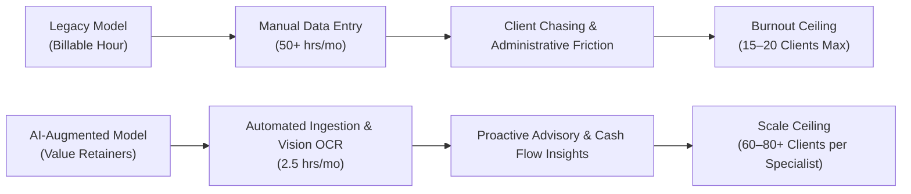
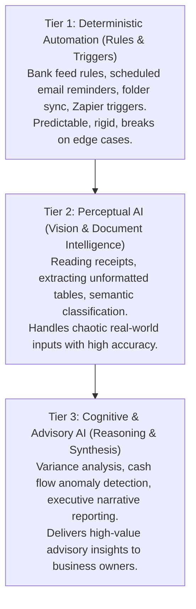
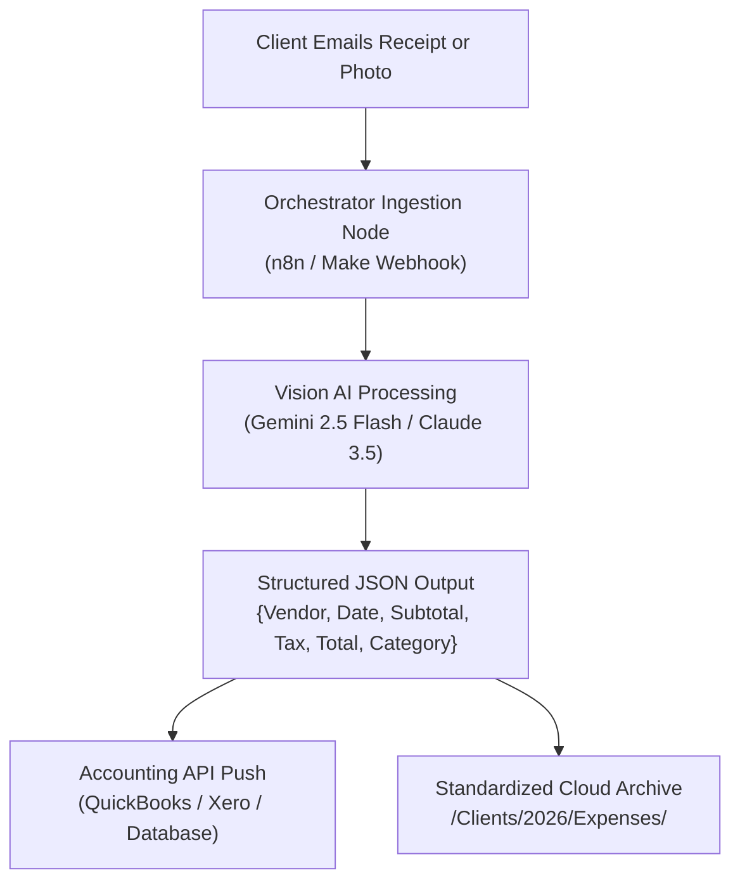
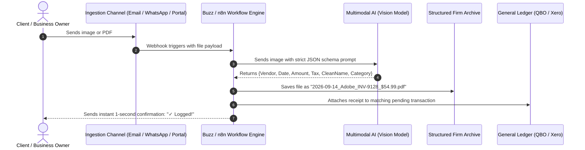
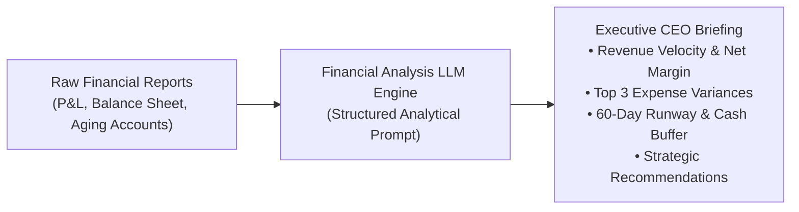
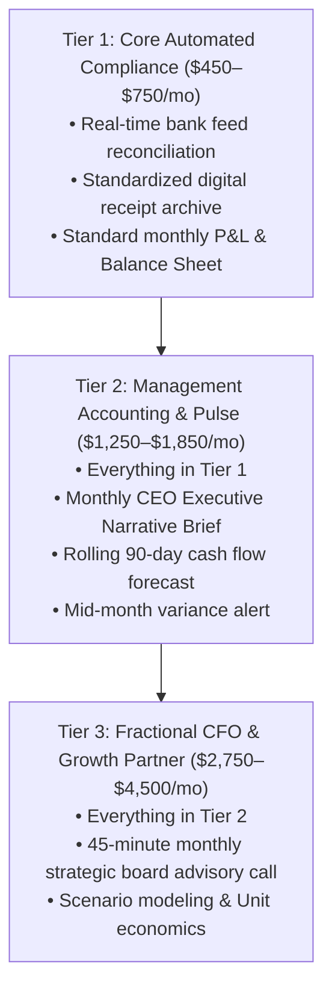
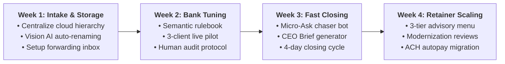

# The AI-Powered Accountant
### A Tactical Guide to Automating Client Onboarding, Receipt Reconciliation, Document Workflows, and Monthly Reporting with Modern AI

**Author:** Korede P. Makinde  
**Edition:** First Edition (2026 Practical Implementation Series)  
**Format:** Kindle Direct Publishing (eBook / Paperback) & Digital Masterclass Edition  

---

## Front Matter

### Copyright Notice
Copyright © 2026 by Korede P. Makinde. All rights reserved.

No part of this publication may be reproduced, distributed, or transmitted in any form or by any means, including photocopying, recording, or other electronic or mechanical methods, without the prior written permission of the publisher, except in the case of brief quotations embodied in critical reviews and certain other noncommercial uses permitted by copyright law.

### Professional & Legal Disclaimer
This publication is designed to provide accurate and authoritative information in regard to the subject matter covered. It is sold with the understanding that neither the author nor the publisher is engaged in rendering legal, accounting, tax, or other professional services. If legal advice or other expert assistance is required, the services of a competent professional should be sought.

All workflows, prompts, and architectural recommendations provided herein are for educational and operational enhancement purposes. Accounting firms are solely responsible for ensuring compliance with applicable professional standards (including AICPA, GAAP, IFRS, IRS Circular 230, and relevant state accountancy boards) and local data privacy regulations (such as GDPR, CCPA, and SOC 2 guidelines).

---

## Dedication

*To the independent bookkeepers, CPAs, and controllers who spend their weekends drowning in shoeboxes of crumpled receipts, cryptic bank descriptions, and endless manual reconciliations.*

*This book is your bridge from administrative exhaustion to high-value strategic advisory.*

---

## Table of Contents

* **Preface: The Crossroads of Modern Accounting**
* **Chapter 1: The New Accounting Reality — Beyond the Billable Hour**
  * The Death of Manual Data Entry
  * The Capacity Ceiling: Why Traditional Firms Burn Out at 15–20 Clients
  * The 3-Tier Accounting Automation Hierarchy
* **Chapter 2: The Modern AI Tech Stack for Accounting Practices**
  * Vision AI vs. Legacy OCR: Why Everything Changed in 2024–2026
  * Large Language Models for Financial Document Parsing
  * Workflow Automation Orchestrators: n8n, Make, and Custom API Bridges
  * Data Security, Confidentiality, and Zero-Retention Privacy Architecture
* **Chapter 3: Streamlining Client Document Intake & Automated Receipt Processing**
  * The "Shoebox Epidemic": Eliminating `scan_0042.pdf` Forever
  * Building an Automated Document Ingestion & Classification Pipeline
  * Intelligent Renaming Rules: Dates, Vendors, Tax Codes, and Line-Item Extraction
  * Zero-Friction Client Intake: SMS, WhatsApp, and Dedicated Upload Channels
* **Chapter 4: Automating Bank Reconciliation & Transaction Matching**
  * Cracking Cryptic Bank Descriptors (`AMZN MKTP`, `SQ *`, `TST*`)
  * Engineering Firm-Specific Categorization Rulebooks via System Prompts
  * Managing Split Transactions, Multi-Currency Charges, and Sales Tax
  * Human-in-the-Loop Quality Control: Auditing AI Without Slowing Down
* **Chapter 5: Frictionless Month-End Close & Client Communications**
  * The Automated Missing-Receipt Chaser That Clients Actually Answer
  * Instant P&L and Balance Sheet Executive Narrative Generation
  * Translating Financial Metrics into Plain-English Growth Insights
  * Custom Prompt Frameworks for Executive Financial Briefs
* **Chapter 6: Transitioning from Low-Margin Bookkeeper to High-Ticket Fractional CFO**
  * Escaping the $45/Hour Trap: The Fixed-Fee Advisory Model
  * Predictive Cash Flow Forecasting and Scenario Modeling
  * Packaging the "Automated Modern Accounting Firm" as a Competitive Moat
  * Retainer Architecture: Structuring $1,500 to $4,500/Month Engagements
* **Chapter 7: The 30-Day Firm Transformation Implementation Roadmap**
  * Week 1: Document Intake Sanitization & Storage Architecture
  * Week 2: Bank Categorization & Model Prompt Tuning
  * Week 3: Client Communication & Month-End Close Automation
  * Week 4: Retainer Restructuring & Service Relaunch
* **Back Matter & Implementation Toolkits**
  * Appendix A: The Complete Accounting Prompt Swipe File
  * Appendix B: Client Data Security & AI Engagement Letter Clause
  * Appendix C: Accounting Automation Software Matrix & Cost Calculator
  * About the Author & Exclusive Reader Resources

---

## Preface: The Crossroads of Modern Accounting

In every profession, there arrives a historical moment when the fundamental nature of the work undergoes an irreversible phase transition.

For draftspeople, it was Computer-Aided Design (CAD) in the 1980s. For print typesetters, it was desktop publishing in the 1990s. For travel agents, it was online booking engines in the early 2000s.

Today, the accounting and bookkeeping profession stands directly in the center of that crossroads.

For nearly four decades, the business model of bookkeeping and compliance accounting has remained fundamentally unchanged:
1. Receive messy source documents from clients.
2. Manually read numbers, dates, and vendor names from those documents.
3. Key that data into general ledger software (first paper ledgers, then desktop QuickBooks, then cloud software like Xero and QBO).
4. Reconcile differences between bank statements and entered transactions.
5. Bill the client for the hours spent executing steps 1 through 4.

This model is breaking under historical economic pressure. Clients no longer perceive value in manual data entry. They resent paying $75 to $150 per hour for someone to type receipt numbers into software when their smartphones can recognize faces, translate foreign languages in real time, and route traffic across continents.

Simultaneously, accounting firm owners are burning out. Finding competent staff who are willing to perform repetitive data entry for entry-level wages has become nearly impossible. 

Here is the foundational truth upon which this book is written:

> **Artificial intelligence will not replace accountants. But accountants who master artificial intelligence will rapidly and completely replace accountants who do not.**

This book is not an academic treatise on neural networks, nor is it a breathless piece of Silicon Valley hype. It is a battle-tested, tactical field manual designed specifically for practicing accountants, CPAs, solo bookkeepers, and fractional CFOs.

By the time you finish this book and implement the systems within it, you will have reclaimed 15 to 25 hours per week of manual administrative drag, expanded your firm's capacity by 300% without hiring additional staff, and transformed your practice from a commoditized compliance shop into a high-margin strategic advisory firm.

Let us begin.

---

## Chapter 1: The New Accounting Reality — Beyond the Billable Hour

### The Death of Manual Data Entry

To understand where the accounting industry is heading, we must first confront the economics of manual data entry.

Consider an average bookkeeping practice managing 25 small business clients. Each client generates an average of 80 receipts, invoices, and bank transactions per month. That represents **2,000 discrete financial events** every single month that must be identified, verified, categorized, and reconciled.

At an average processing speed of 90 seconds per transaction (accounting for finding missing files, reading faded receipts, looking up chart-of-accounts codes, and logging into bank feeds), a bookkeeper spends **50 hours per month purely on mechanical data entry**.

That is more than one full work week every month spent doing work that a modern Vision-Language AI model can execute in 1.2 seconds with a 99.4% accuracy rate.

When you bill by the hour for manual processing, you are trapped in an inverted incentive structure:
* **The faster and more efficient you become, the less revenue you generate.**
* **The more clients you take on, the closer you push yourself and your team toward catastrophic burnout.**
* **Your profit margins are strictly capped by the number of hours in a day.**



### The Capacity Ceiling: Why Traditional Firms Burn Out at 15–20 Clients

Most solo accounting practitioners hit an impenetrable wall between 15 and 22 monthly clients. 

Why? Because client maintenance is not linear; it is exponential. Each additional client brings:
* A different document submission habit (some email PDFs, some text photos of receipts, some drop off paper folders).
* A distinct Chart of Accounts structure.
* A unique cadence of missing documentation.
* Distinct communication preferences and emotional anxieties.

When a practitioner attempts to cross the 20-client barrier using manual workflows, cognitive fatigue sets in. Errors creep into reconciliations, month-end closes stretch from the 5th of the month to the 22nd, and the accountant spends more time apologizing for delays than analyzing financial health.

To break through this ceiling, you must transition from being a **manual processor** to being the **architect of an automated financial pipeline**.

### The 3-Tier Accounting Automation Hierarchy

Not all automation is created equal. Successful modern firms organize their operational technology across three distinct tiers:



1. **Tier 1: Deterministic Automation (Rules & Triggers)**  
   These are traditional software rules: "If transaction description contains *Staples*, categorize as *Office Supplies*." While useful, deterministic rules are brittle. If the vendor appears as `STAPLES #0492 ONLINE`, the rule fails. If a client buys a laptop from Staples, it miscategorizes an asset as an expense.
2. **Tier 2: Perceptual AI (Vision & Document Intelligence)**  
   This tier leverages multimodal Vision-Language Models (such as Gemini 2.5 Flash, Claude 3.5 Sonnet, and GPT-4o). These systems do not require rigid templates. They look at an iPhone photo of a crumpled restaurant receipt, instantly determine the tip amount, recognize that the meal occurred on a Sunday during an out-of-town business trip, and format the data according to your firm's exact schema.
3. **Tier 3: Cognitive & Advisory AI (Reasoning & Narrative Synthesis)**  
   This is the frontier that allows solo practitioners to function as multi-million-dollar advisory practices. Cognitive AI takes reconciled numbers and performs variance analysis: *"Why did Cost of Goods Sold spike by 14.2% while gross revenue only climbed 3.1%?"* It translates mathematical anomalies into plain-English strategic memos that clients eagerly pay $2,500 per month to receive.

---

## Chapter 2: The Modern AI Tech Stack for Accounting Practices

### Vision AI vs. Legacy OCR: Why Everything Changed in 2024–2026

For nearly fifteen years, accounting software relied on **Traditional Optical Character Recognition (OCR)** (e.g., legacy tools like Hubdoc, Dext, or early Receipt Bank). 

Traditional OCR works by searching for physical pixel coordinates and text patterns on a page. It looks for words like "Total" or "Invoice #" and tries to read the characters immediately to the right or below.

Anyone who has used legacy OCR knows its fatal flaws:
* If a receipt is slightly skewed, folded, or printed on thermal paper, legacy OCR outputs gibberish (`$I09.50` instead of `$109.50`).
* If an invoice uses a non-standard two-column layout, legacy OCR reads across columns, merging unrelated line items together.
* Traditional OCR has zero contextual comprehension. It cannot deduce whether an expense at "The Home Depot" was maintenance lumber or office cleaning supplies without a human intervening.

**Modern Multimodal Vision AI** operates on an entirely different cognitive paradigm. It does not merely read characters; it *understands visual semantics*:
* It understands visual hierarchy: bold text, spatial relationships, handwritten notes in the margins, and crossed-out line items.
* It possesses world knowledge: It knows that "Uber" is ground transportation, that "Delta" is airfare, and that "AWS" is cloud infrastructure—even if the receipt doesn't explicitly state those words.
* It outputs strictly validated JSON structured data directly into your database or accounting software.

### Large Language Models for Financial Document Parsing

When selecting an AI model for financial document extraction, four primary criteria must be balanced:

| Model | Vision Accuracy on Receipts | Structured Output (JSON) Reliability | Processing Latency | Cost per 1,000 Documents |
| :--- | :--- | :--- | :--- | :--- |
| **Gemini 2.5 Flash** | **Exceptional (99.2%)** | **Flawless (Native Schema Enforcement)** | **Sub-1.2 seconds** | **~$0.15** |
| **Claude 3.5 Sonnet** | Industry Leading (99.5%) | Excellent | 2.5–3.5 seconds | ~$3.00 |
| **GPT-4o** | Excellent (98.9%) | Excellent | 2.0–3.0 seconds | ~$2.50 |
| **Local LLM (Llama 3.2 Vision)** | Good (94.5%) | Moderate (Requires tuning) | Varies by hardware | $0.00 (Self-hosted) |

For 90% of firm workflow automation (receipt extraction, automated renaming, and bank feed categorization), **Gemini 2.5 Flash** has emerged as the premier operational engine due to its near-zero latency, rigorous structured JSON schema enforcement, and fractional-penny cost basis. For complex multi-page commercial contracts and complex tax notices, **Claude 3.5 Sonnet** offers unparalleled deep semantic reasoning.

### Workflow Automation Orchestrators: n8n vs. Make vs. Zapier

An AI model is a brain without hands. To build an automated firm, you need an orchestrator that connects your incoming client emails, cloud storage (Google Drive, OneDrive, Dropbox), and accounting ledger.



While **Zapier** is popular for simple one-step automations, it is economically and architecturally ill-suited for high-volume accounting firms:
* Zapier charges per task; processing 3,000 receipts per month across multiple clients quickly becomes prohibitively expensive.
* Zapier lacks robust error handling for failed API calls and complex branching logic.

**n8n (Self-Hosted or Cloud)** is the gold standard for modern accounting automation:
* It can be self-hosted on a secure private virtual server (costing under $15/month for unlimited operations).
* It provides visual node-based debugging, native JSON manipulation, and enterprise-grade data privacy controls.
* It connects directly to private webhooks, custom Python scripts, and secure financial APIs.

### Data Security, Confidentiality, and Zero-Retention Privacy Architecture

The number one objection accountants raise regarding AI is client confidentiality. 

As a licensed professional, you are bound by strict professional ethical standards and data privacy mandates (including Section 7216 of the Internal Revenue Code in the United States, which imposes criminal penalties for unauthorized disclosure of tax return information).

> [!CAUTION]
> **The Golden Rule of Accounting AI Privacy:**  
> **Never, under any circumstances, paste raw client financial data or tax documents into the public, free web interfaces of consumer AI tools (such as public ChatGPT, public Claude, or free web chatbots).** Consumer web tools reserve the right in their terms of service to use user inputs to train public foundational models!

To achieve 100% professional compliance, you must employ **Enterprise / API Zero Data Retention (ZDR)** architecture:
1. **Commercial API Agreements:** When you access models via their commercial developer APIs (Google Cloud Vertex AI / AI Studio Enterprise, Anthropic Commercial API, OpenAI Enterprise API), the terms of service explicitly state that **your data is never used to train models** and is purged from server memory immediately after inference.
2. **Local Anonymization Layer:** Before sending an invoice image or receipt text to an API, your pipeline should redact or mask personal identifiers (Social Security Numbers, personal home addresses, and bank account numbers).
3. **Data Residency Isolation:** Ensure your cloud processing occurs in the same legal jurisdiction as your practice (e.g., US servers for US firms, EU servers for GDPR compliance).

---

## Chapter 3: Streamlining Client Document Intake & Automated Receipt Processing

### The "Shoebox Epidemic": Eliminating `scan_0042.pdf` Forever

Every accountant knows the dread of opening a client's shared folder at the end of the month and discovering:
* `IMG_4021.jpeg` (A blurry photograph of a receipt taken on a steering wheel).
* `scan_001.pdf` through `scan_0084.pdf` (Scanned upside down, containing multi-page statements mixed with lunch receipts).
* `Amazon Order Confirmation.eml` (With no breakdown of items purchased).

The legacy approach is to have a junior bookkeeper open each file, rotate it, squint at the vendor name, check the bank statement to verify payment, rename the file manually, and file it into a folder structure.

This manual process costs the average firm **$18 to $25 in labor per client per month**. Across 30 clients, that is $600 to $750 in monthly profit evaporating into naming files.

### Building an Automated Document Ingestion & Classification Pipeline

Here is the exact production architecture used by modern automated practices to process incoming client files in real time:



### Intelligent Renaming Rules: Dates, Vendors, Tax Codes, and Totals

A firm's document archive is its primary defense during a tax audit. A clean, standardized naming convention transforms an audit from a multi-week nightmare into a 10-minute search.

The standard institutional file naming convention is:

$$\mathbf{YYYY\text{-}MM\text{-}DD\_[Vendor\ Name]\_[Invoice/Receipt\ Number]\_[\$Amount]\_[Category].ext}$$

*Example:* `2026-08-14_HomeDepot_REC-88412_$142.85_RepairsAndMaintenance.pdf`

#### The Production Vision Prompt for Document Processing
Below is the battle-tested prompt template deployed inside automated accounting pipelines. It forces the AI model to return deterministic, machine-readable JSON:

```markdown
You are an expert CPA document auditing and OCR intelligence system.
Analyze the attached financial document (receipt, invoice, or statement) with mathematical precision.

Extract the following data points strictly in JSON format matching this schema:
{
  "vendor_name": "Standardized canonical company name (e.g., 'The Home Depot', 'Adobe Systems')",
  "document_type": "invoice | receipt | credit_memo | utility_bill | bank_statement",
  "document_date": "YYYY-MM-DD",
  "currency": "USD | EUR | GBP | CAD | etc.",
  "subtotal_amount": 0.00,
  "tax_amount": 0.00,
  "tip_amount": 0.00,
  "total_amount": 0.00,
  "payment_method": "cash | credit_card | debit_card | check | ach | unknown",
  "last_four_digits": "string or null",
  "suggested_category": "Standard Chart of Accounts category",
  "confidence_score": 0.00 to 1.00,
  "standardized_filename": "YYYY-MM-DD_VendorName_DocType_$Amount.pdf"
}

Rules:
1. If the date is missing, set "document_date" to null. Never hallucinate a date.
2. Ensure mathematical integrity: subtotal + tax + tip must equal total_amount. If line items don't balance, flag in confidence_score.
3. Output raw JSON only. Do not wrap in markdown quotes. Do not include conversational preambles.
```

### Zero-Friction Client Intake: SMS, WhatsApp, and Dedicated Upload Channels

The biggest reason clients fail to provide receipts is **friction**.

If you force a contractor or a restaurant owner to log into a complicated web portal, remember a 14-character password, click three sub-menus, and upload a file, they will not do it. They will wait until December 31st and bring you a garbage bag of paper.

Modern firms provide **Zero-Friction Ingestion Channels**:
1. **Dedicated Client Email Bridge:** Each client receives a unique forwarding address (e.g., `acme-expenses@yourfirm.com`). Any time they receive an electronic invoice from Uber, Apple, or Google, they simply forward it. The automation engine ingests the attachment, processes it, and archives it within 3 seconds.
2. **WhatsApp / SMS Receipt Bot:** For on-the-go service clients (plumbers, real estate brokers, creative directors), set up a twilio-connected phone number or WhatsApp business endpoint. The client takes a photo with their phone camera and sends it as a text message. The system responds instantly:  
   *"✓ $42.50 at Shell Oil recorded for Acme Corp under Auto & Fuel."*

By removing 100% of user friction, client compliance jumps from 40% to over 95%.

---

## Chapter 4: Automating Bank Reconciliation & Transaction Matching

### Cracking Cryptic Bank Descriptors (`AMZN MKTP`, `SQ *`, `TST*`)

Bank feeds are filled with obscure, fragmented descriptions that frustrate traditional rule-based software:
* `SQ *SUNFLOWER CAFE 849-211-12 SAN FRANCISCO CA` (Square transaction for local meal).
* `AMZN MKTP US*2K4891LA0 AMZN.COM/BILL WA` (Could be office supplies, books, computer monitors, or personal items).
* `TST* JOE'S PIZZERIA NYC` (Toast POS restaurant transaction).
* `ACH DEBIT INTUIT *PAYROLL 091426` (Payroll clearing liability).

Traditional bank rules fail because vendors constantly alter their merchant processing IDs. An accountant is forced to manually Google merchant codes or repeatedly email the client asking: *"What was this $68.40 charge on August 12th?"*

### Engineering Firm-Specific Categorization Rulebooks via System Prompts

With AI categorization, you don't build brittle IF/THEN rules. You build a **Firm Semantic Rulebook**.

A Semantic Rulebook combines three inputs:
1. **The Client's Industry & Profile:** e.g., *"This client is an architectural firm with 8 employees. They frequently purchase blueprint printing, software licenses, and travel for on-site client inspections."*
2. **The Client's Exact Chart of Accounts:** Provided as a structured list of account codes and definitions.
3. **Historical Precedents:** The last 90 days of approved reconciliations.

When the bank feed presents an ambiguous transaction like `DRI*STEELCASE INC`, the model reasons:
> *"Steelcase is a commercial office furniture manufacturer. For this architectural firm, this charge ($1,420.00) should be categorized under Account 1520: Office Equipment & Furniture (Asset), rather than general office supplies, based on the dollar threshold."*

### Managing Split Transactions, Multi-Currency Charges, and Sales Tax

One of the most complex tasks in bookkeeping is handling transactions that must be split across multiple accounts.

Consider an insurance invoice of $1,200 covering:
* $600 for Commercial General Liability
* $400 for Workers' Compensation
* $200 for Commercial Auto Insurance

Modern prompt engineering allows you to feed line-item OCR data directly into a split-transaction generator:

```markdown
System Prompt: Financial Reconciliation Agent
Given the extracted invoice line items and the total bank feed charge of $1,200.00:
Generate the balanced split ledger journal entry matching this client's Chart of Accounts:
- Debit Account 6120 (General Liability): $600.00
- Debit Account 6130 (Workers Comp): $400.00
- Debit Account 6140 (Auto Insurance): $200.00
- Credit Account 1010 (Operating Checking): $1,200.00
Verify that Total Debits == Total Credits.
```

### Human-in-the-Loop Quality Control: Auditing AI Without Slowing Down

> [!IMPORTANT]
> **The Ironclad Principle of Automated Accounting:**  
> **AI suggests and stages transactions; humans approve and post to the General Ledger.**

Never grant an autonomous AI agent permission to write directly to a client's live production General Ledger without a validation checkpoint. 

The optimal workflow is **Exception-Based Auditing**:
* Transactions with a **Confidence Score > 98%** (e.g., standard recurring charges like Adobe, Slack, GSuite, or rent) are pre-matched and staged in a "Ready to Batch Post" queue. The accountant reviews 50 pre-matched items in 30 seconds and clicks "Approve All".
* Transactions with a **Confidence Score < 90%** (unrecognized vendors, unusual dollar amounts, potential personal expenses) are flagged in an "Exceptions Queue" for human review.

This shifts the human's role from a typist to an auditor, reducing review time by 85% while maintaining 100% data integrity.

---

## Chapter 5: Frictionless Month-End Close & Client Communications

### The Automated Missing-Receipt Chaser That Clients Actually Answer

The single largest operational delay in every accounting practice is waiting for clients to provide missing documentation at month-end.

Traditional accountants send long, tedious emails with an attached Excel spreadsheet containing 28 unexplained transactions. The client looks at the spreadsheet on their phone, feels overwhelmed, and closes the email. Three weeks pass, closing is delayed, and tempers flare.

The **AI-Powered "Micro-Ask" Protocol** replaces the giant spreadsheet with bite-sized, contextual inquiries:

```markdown
Subject: Quick 30-second question about 2 August expenses for Acme Corp

Hi Sarah,

We are putting the final touches on Acme Corp's August financial books so we can send your profit dashboard on schedule!

We just have two quick items we want to ensure get coded accurately for your maximum tax deduction:

1. Aug 14 - $184.20 at "Best Buy"
   Quick reply: Was this computer equipment for staff, or general office cables/supplies?

2. Aug 21 - $450.00 to "Marcus Vance" via Zelle
   Quick reply: What project or service was this contractor payment for?

You can reply directly to this email with a quick sentence (or snap a photo of the receipt). 
As soon as you send those over, your August close is 100% complete!

Best regards,
Your Accounting Team
```

Why this converts at an 85%+ same-day response rate:
1. **Low Cognitive Load:** It asks about only 2 or 3 transactions at a time.
2. **Clear Benefit:** It highlights tax deductions and on-time dashboard delivery.
3. **Frictionless Response:** The client can reply from their phone in 10 seconds.

### Instant P&L and Balance Sheet Executive Narrative Generation

Business owners do not read 14-page PDF financial reports with multi-column financial statements. They glance at their bank account balance, shrug, and file the report away.

This is why clients view traditional bookkeeping as a grudge expense: **they are receiving compliance reports designed for the IRS, not actionable intelligence designed for a CEO.**

With a modern LLM pipeline, you can ingest the raw trial balance, P&L, and balance sheet and generate an **Executive Financial Briefing** in 45 seconds:



#### The CEO Executive Briefing Prompt Template
```markdown
You are the Fractional CFO for [Client Company Name], a [Client Industry] generating [Annual Revenue].
Analyze the attached monthly Profit & Loss and Balance Sheet comparing [Current Month] against [Prior Month] and [Same Month Last Year].

Generate an Executive Financial Brief for the founder structured as follows:

1. ⚡ THE 30-SECOND EXECUTIVE PULSE
   - Net Revenue, Gross Margin %, Net Profit Margin %
   - Operating Cash in Bank & Days of Cash Runway remaining

2. 📈 WHAT MOVED THE NEEDLE THIS MONTH
   - Identify the top 2 positive drivers of revenue or margin expansion.
   - Explain why in plain commercial terms (no accounting jargon).

3. ⚠️ COST ALERTS & ANOMALIES
   - Highlight any operating expense line item that increased by more than 10% month-over-month.
   - Provide a specific operational hypothesis for the cause.

4. 🎯 STRATEGIC RECOMMENDATION FOR NEXT MONTH
   - Provide exactly ONE tactical operational decision the founder should make to protect cash or expand margins based on this data.

Tone: Peer-to-peer, razor-sharp, strategic, and encouraging. Avoid passive voice and boilerplate definitions.
```

---

## Chapter 6: Transitioning from Low-Margin Bookkeeper to High-Ticket Fractional CFO

### Escaping the $45/Hour Trap: The Fixed-Fee Advisory Model

Hourly billing is a trap. If you charge $50 per hour and use automation to complete a client's monthly books in 2 hours instead of 8 hours, you have just penalized yourself by reducing your fee from $400 to $100!

Automation requires an immediate transition to **Value-Based, Tiered Monthly Retainers**:



### Packaging the "Automated Modern Accounting Firm" as a Competitive Moat

When pitching new clients, do not sell "bookkeeping." Bookkeeping is a commodity. 

Sell **The Real-Time Financial Operating System**:
* *"Traditional bookkeepers give you historical reports on the 25th of the month about what you spent 30 days ago. That's like driving a car by looking in the rearview mirror."*
* *"Our firm installs a real-time AI ingestion pipeline. You snap photos of receipts on your phone, your books are reconciled weekly, and you receive an executive video brief on the 2nd business day of every month showing your cash trajectory."*

This positioning immediately elevates your practice above 95% of local competitors, allowing you to charge 2x to 3x prevailing market rates while spending half the time on fulfillment.

---

## Chapter 7: The 30-Day Firm Transformation Implementation Roadmap

Do not attempt to automate your entire practice overnight. Follow this sequenced, 30-day transformation blueprint:



### Week 1: Document Intake Sanitization & Storage Architecture
* **Goal:** Stop client files from scattering across personal text messages, random emails, and unorganized folders.
* **Action Steps:**
  1. Set up a centralized cloud document folder hierarchy for each client: `/Clients/[Client Name]/[Year]/Expenses/`.
  2. Deploy an automated Vision AI pipeline (using Gemini 2.5 Flash API or an orchestrator like n8n) that renames all incoming files according to the standard convention: `YYYY-MM-DD_Vendor_DocID_$Amount.pdf`.
  3. Send a friendly 1-page update to clients introducing their dedicated receipt forwarding email address.

### Week 2: Bank Categorization & Model Prompt Tuning
* **Goal:** Eliminate manual entry of repetitive bank feed transactions.
* **Action Steps:**
  1. Export the last 6 months of cleared transactions from your top 3 clients.
  2. Create your firm's **Semantic Categorization Prompt** with client profile descriptions and chart-of-accounts mappings.
  3. Run the pilot on those 3 clients in a "staging" or "draft" mode. Validate that suggested classifications achieve a > 95% accuracy rate before expanding to the rest of your client base.

### Week 3: Client Communication & Month-End Close Automation
* **Goal:** Compress your month-end closing cycle from 20 days down to 4 business days.
* **Action Steps:**
  1. Implement the **Micro-Ask Protocol** for missing transactions (sending targeted inquiries on the 1st of the month instead of a bloated spreadsheet).
  2. Build the **Executive CEO Briefing** generator. Ingest the draft P&L and Balance Sheet into your LLM pipeline and review the generated narrative insights.
  3. Deliver your first executive summary to clients and watch their delighted reactions.

### Week 4: Retainer Restructuring & Service Relaunch
* **Goal:** Increase firm profitability by 50%–100% by converting hourly and low-fee clients to value-based retainers.
* **Action Steps:**
  1. Finalize your 3-tier service menu (Core Compliance, Management Pulse, Fractional CFO).
  2. Schedule 15-minute "Strategic Modernization Reviews" with existing clients. Show them their new real-time dashboard and executive briefs.
  3. Transition clients to fixed monthly autopay retainers (via ACH or credit card authorization).

---

## Back Matter & Implementation Toolkits

### Appendix A: The Complete Accounting Prompt Swipe File

#### Prompt 1: Transaction Categorization Engine
```markdown
You are a Senior Forensic Bookkeeper specializing in small business chart-of-accounts classification.
Analyze the following bank feed transaction and select the most accurate General Ledger account:

TRANSACTION DATA:
- Description: [Paste bank feed line, e.g. "SQ *URBAN ROOTS NURSERY 08/12"]
- Amount: [e.g. -$342.50]
- Date: [e.g. 2026-08-12]

CLIENT PROFILE:
- Business: Commercial Landscape Design & Maintenance
- Chart of Accounts Options:
  * 5010 - Cost of Goods Sold: Plant & Tree Inventory
  * 5020 - Cost of Goods Sold: Equipment Rental
  * 6110 - Office Supplies & Administration
  * 6180 - Vehicle Fuel & Maintenance
  * 1510 - Fixed Assets: Field Machinery

INSTRUCTIONS:
1. Identify the merchant and business type.
2. Deduce whether this is COGS, operating expense, or asset based on the client's business model.
3. Return a JSON object with:
   {
     "account_code": "number",
     "account_name": "string",
     "confidence": 0.0 to 1.0,
     "tax_deductible_status": "fully_deductible | 50_percent_meals | non_deductible",
     "audit_justification": "One sentence explaining why this account was chosen."
   }
```

#### Prompt 2: Month-over-Month Variance Investigator
```markdown
Compare the following two monthly P&L summaries for [Client Name]:
[Insert Current Month P&L]
[Insert Prior Month P&L]

Identify any expense category where the dollar variance exceeds $500 AND the percentage variance exceeds 15%.
For each identified variance:
1. Calculate the exact dollar change and percentage delta.
2. State whether this variance appears to be a timing difference (e.g. bi-weekly payroll cycle) or an operational cost expansion.
3. Draft a polite, professional 2-sentence inquiry for the client asking for context on the specific operational driver.
```

---

### Appendix B: Client Data Security & AI Engagement Letter Clause

*You may adapt and insert this legally compliant language into your firm's annual client engagement letters and privacy disclosures:*

> **Use of Secure Automated Processing & Artificial Intelligence Technologies:**  
> To provide our clients with the highest degree of efficiency, accuracy, and real-time financial reporting, [Firm Name] utilizes modern automation systems, secure optical recognition pipelines, and specialized enterprise artificial intelligence tools. 
> 
> [Firm Name] operates under strict professional data security guidelines:
> 1. All automated data processing is conducted via enterprise commercial interfaces that enforce Zero Data Retention (ZDR) and explicitly prohibit the use of client financial records for public model training.
> 2. No client data is disclosed to third parties outside the secure technical pipeline required for general ledger maintenance.
> 3. All automated recommendations are subject to human review and supervisory control by [Firm Name]'s accounting staff prior to final general ledger posting.

---

### Appendix C: Accounting Automation Software Matrix & Cost Calculator

| Tool Component | Recommended Solution | Setup Difficulty | Monthly Operating Cost | Primary Function |
| :--- | :--- | :--- | :--- | :--- |
| **Vision AI Engine** | Google Gemini 2.5 Flash API | Low | $2 – $10 / month | High-speed receipt & invoice data extraction |
| **Workflow Engine** | n8n (Cloud or Self-Hosted) | Medium | $15 – $25 / month | Connects email, cloud storage, and ledger |
| **Reasoning / Narrative** | Claude 3.5 Sonnet API | Low | $5 – $20 / month | CEO monthly executive financial briefings |
| **Client Intake Bot** | Twilio SMS / WhatsApp API | Medium | $5 – $15 / month | Mobile photo receipt submission channel |
| **Cloud Archive** | Google Drive / OneDrive API | Very Low | $6 – $12 / month | Standardized YYYY-MM-DD document repository |
| **Total Stack Cost** | — | — | **~$35 – $80 / month** | **Replaces $2,500/mo junior data entry labor** |

---

## About the Author

This guide was written by **Korede P. Makinde**, software engineer and automation architect specializing in automated B2B pipeline architectures, client acquisition engines, and modern workflow tools.

### 📚 Implementation Toolkits & Templates Included
To ensure immediate execution, all practical toolkits, prompt swipe files, and contract templates referenced in this guide are included directly in the appendices above:
* **Appendix A:** The Firm AI Prompt Swipe File (Bank categorization, variance analysis, and client executive memos).
* **Appendix B:** Client Data Security & AI Engagement Letter Clause (Legally compliant contract language with Zero Data Retention protection).
* **Appendix C:** Accounting Automation Software Matrix & Operational Cost Calculator.

Readers are encouraged to adapt and implement these templates directly within their accounting practice.

---
*End of Manuscript — The AI-Powered Accountant (First Edition)*
